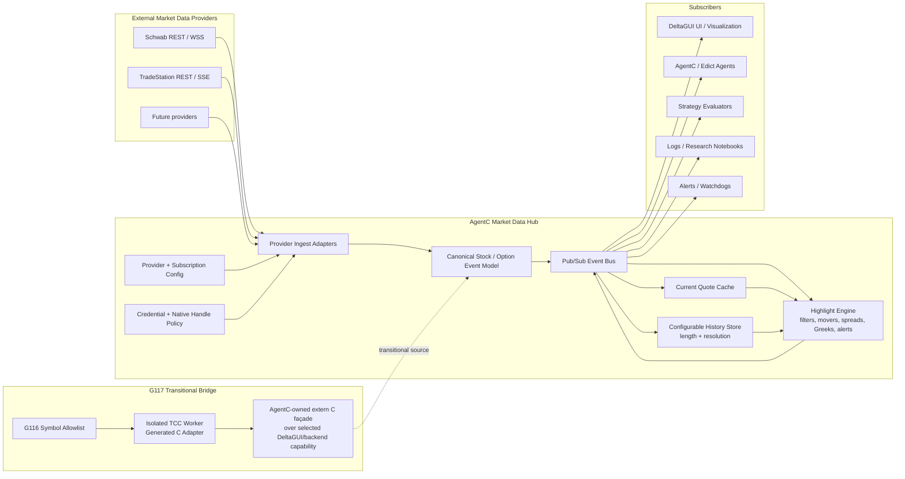

# Goal: G117 — AgentC / DeltaGUI Market Data Hub Integration

**Status**: IN PROGRESS — Phases 0–3 implemented and verified 2026-07-07; Phase 4 (migration path) not started
**Created**: 2026-06-21
**Redesigned**: 2026-07-07
**Parent/Track**: AgentC Market Data Hub / TinyCC Native Interoperability / Downstream Applications
**Depends On**: 🔗[G116 — TCC Native Symbol Cache and C ABI Bridge](../G116-TccNativeSymbolCacheCAbiBridge/index.md)

## Objective

Redesign the DeltaGUI backend integration as an AgentC-native market-data hub: AgentC configures provider subscriptions, ingests stock/option information and streaming quotes, normalizes those events, retains configurable history, computes requested highlights, and publishes both raw/derived data to interested subscribers such as DeltaGUI, strategy agents, alerts, and research tools.

The earlier "DeltaGUI backend tool adapter" scope is now the **first bridge slice** inside this larger design: a narrow AgentC-owned `extern "C"` façade over one safe/read-only DeltaGUI/backend capability, registered through the G116 symbol allowlist and invoked from isolated TCC workers.

## Rationale

The desired integration is not simply "let AgentC call DeltaGUI." The higher-value architecture is to rebuild the backend responsibilities as an application of AgentC itself:

- AgentC owns the control plane, subscription policy, event normalization, durable state/history, highlight computation, and subscriber publication.
- DeltaGUI becomes a first-class subscriber/client of the hub and, during migration, may also expose selected existing backend capabilities through a stable C ABI façade.
- Provider-specific credentials, OAuth state, stream transports, native handles, and C++ implementation details remain behind native/provider boundaries.
- Generated C/TCC adapters are used as controlled, isolated adapter executors, not as a general-purpose way to compile or bind arbitrary DeltaGUI C++.

This reframing preserves the TinyCC safety model while giving G117 a concrete product direction: an AgentC-hosted pub/sub market-data platform for stocks, options, histories, and derived highlights.

## Integration Role Model

| Participant | Role in G117 |
|---|---|
| **AgentC / Edict** | Authoritative market-data application substrate: configuration, orchestration, subscriptions, event routing, history policy, highlight requests, and subscriber publication. |
| **Native provider adapters** | Transport/credential boundary for Schwab, TradeStation, and future market-data providers. They fetch/stream and normalize raw provider payloads but do not own subscriber policy. |
| **DeltaGUI** | Eventual visualization/subscriber client. During migration it may also be a legacy capability source through a narrow C ABI façade. |
| **C ABI façade** | Anti-corruption boundary over selected C++ backend capabilities. It exposes JSON/string/scalar contracts and hides C++ types, provider handles, and credentials. |
| **TCC worker adapters** | Isolated generated-C executors that call only allowlisted façade/helper symbols and return structured JSON/Listree envelopes. |
| **Subscribers** | DeltaGUI, AgentC agents, strategy evaluators, logs, notebooks, and alert/watchdog consumers interested in configured data/highlights. |

## Conceptual Architecture

## Target Product Semantics

### Provider and subscription configuration

- Configure providers, credentials, stream transports, symbols, option scopes, field filters, and subscriber requests through AgentC-owned JSON/Listree state.
- Keep provider credentials and native runtime handles behind native/provider boundaries; do not pass them into Edict dictionaries or worker task envelopes.

### Normalized event model

Define canonical additive schemas for at least:

- `underlying_quote` — latest bid/ask/last/mark/volume/timestamp for an equity/ETF.
- `option_quote` — option contract quote, Greeks/IV/open interest when available, provider freshness metadata.
- `option_chain_snapshot` — bounded snapshot for a configured symbol/scope.
- `history_sample` — downsampled/retained quote or metric sample at a configured resolution.
- `highlight_event` — derived publication such as mover, unusual spread, stale quote, IV/Greek shift, liquidity change, or strategy-relevant threshold.

### Pub/sub and history

- The hub publishes normalized quote/snapshot/highlight events to named subscribers.
- A current quote cache keeps the latest values for fast subscriber/bootstrap reads.
- A history store retains configurable lengths/resolutions, for example tick, 1s, 1m, 5m, or per-subscriber policy.
- Highlight computations can read both current cache and retained history.

### Highlight publication

- Subscribers request "highlights" by declarative filters rather than receiving every raw quote.
- Highlight definitions should be machine-testable: source event types, lookback window, freshness rule, threshold/ranking policy, and output schema.
- Derived events are re-published onto the same hub so DeltaGUI and agents consume a uniform stream.

## Scope

### In scope

- Architecture and schema design for an AgentC-hosted market-data pub/sub hub.
- Inventory of DeltaGUI/backend provider, quote, stream, cache, and analytics capabilities worth migrating or exposing.
- One safe/read-only C ABI façade over an existing backend capability as a transitional bridge.
- G116 allowlisted symbol registration for the façade.
- Isolated TCC adapter demo returning structured JSON/Listree.
- Initial fixture or single-provider ingest path that exercises the hub model without requiring full DeltaGUI rewrite.
- Subscriber-facing publication contracts for DeltaGUI and AgentC workers.
- Credential/native-handle ownership boundaries.

### Out of scope for the first G117 slice

- Compiling DeltaGUI C++ with TinyCC.
- Making TinyCC depend on Cartographer/libffi.
- Passing raw provider/runtime handles, function pointers, sockets, or credentials through Edict/worker state.
- Replacing all existing DeltaGUI backend code in one pass.
- Full broker-grade market data quality guarantees; early validation may use fixtures or limited live provider paths.
- Trading/order-routing behavior.

## Implementation Phases

### Phase 0 — Architecture and inventory

1. Inventory existing DeltaGUI/GreekScope backend capabilities: provider config/auth, chain snapshots, quote cache, stream lifecycle, subscriptions, history/scaffolded storage, analytics/highlights.
2. Classify each capability as:
   - **source** — existing code AgentC may temporarily call through a façade,
   - **hub responsibility** — logic to rebuild natively in AgentC,
   - **subscriber responsibility** — UI/client behavior that should remain in DeltaGUI.
3. Define canonical event schemas and subscriber query envelopes.
4. Define history retention/resolution policy and freshness/data-quality rules.

### Phase 1 — Transitional C ABI bridge probe

1. Pick one safe/read-only capability, preferably fixture-backed or cache/status-oriented.
2. Expose it through an AgentC-owned `extern "C"` façade returning JSON/string output with explicit memory ownership.
3. Register only the selected façade symbols through the G116 symbol cache.
4. Demonstrate an isolated TCC adapter calling the façade and returning a normalized JSON/Listree envelope.

### Phase 2 — Hub MVP

1. Add a fixture or one-provider ingest path that emits canonical quote/snapshot events.
2. Route events through an AgentC-owned pub/sub bus abstraction.
3. Maintain a current quote cache plus bounded history at one configurable resolution.
4. Publish events to at least one DeltaGUI-shaped subscriber and one AgentC/Edict-shaped subscriber.

### Phase 3 — Highlight engine

1. Define a first highlight schema and a machine-testable rule, e.g. quote freshness breach, option spread width outlier, IV shift, or selected-contract price movement.
2. Compute highlights from current cache plus bounded history.
3. Re-publish highlights to subscribers as ordinary hub events.

### Phase 4 — Migration path

1. Retire or shrink any DeltaGUI backend responsibilities that are now AgentC-owned.
2. Keep DeltaGUI focused on visualization, interaction, and subscriber-side presentation.
3. Preserve provider-specific transport/auth behind native/provider adapters.

## Acceptance Criteria

### Design acceptance

- [x] Inventory current DeltaGUI/backend capabilities and classify them as source, hub responsibility, or subscriber responsibility. *(WP_G117_MarketDataHubPhase0Inventory §1)*
- [x] Define canonical JSON/Listree schemas for `underlying_quote`, `option_quote`, `option_chain_snapshot`, `history_sample`, and `highlight_event`. *(WP §2; implemented as `markethub::MarketEvent` with `type="highlight"` for highlight_event)*
- [x] Define subscriber query/envelope semantics for raw quotes, chain snapshots, history windows, and requested highlights. *(WP §3; `DeltaFeedSubscriber::deltasSinceJson`, `EnvelopeCollectorSubscriber::collectJson`, `MarketHub::historyWindowJson`, declarative `SubscriptionFilter`)*
- [x] Define history retention/resolution policy, freshness rules, and data-quality behavior for missing/stale fields. *(WP §4; `HistoryPolicy`, `freshnessUnix()` fallback, absent-field rule)*
- [x] Document credential, provider-state, socket, native-handle, and C++ ownership boundaries. *(WP §5)*

### Bridge acceptance

- [x] Define a minimal C ABI façade over one safe/read-only DeltaGUI/backend capability. *(GEX analytics; `markethub/facade/greekscope_facade.h` — 5 functions, JSON/string/scalar only, malloc ownership via `agentc_greekscope_free`)*
- [x] Build or load the façade as a separate AgentC-side adapter library; do not pass raw backend/provider handles into Edict or worker contexts. *(`libagentc_greekscope_facade.so` compiled in AgentC's build from read-only `~/DeltaGUI/backend_cpp` sources; zero DeltaGUI modifications; auto-disabled when tree absent)*
- [x] Register selected façade symbols through the G116 symbol cache. *(`allowLibrarySymbol` per function; unauthorized-symbol relocate_error guard retested)*
- [x] Demonstrate an isolated AgentC/TCC adapter calling one façade function and returning a structured Listree/JSON result. *(`GreekscopeFacadeBridgeTest.IsolatedTccWorkerReturnsGexSnapshotJson`: generated-C adapter seeds fixture chain, returns GEX snapshot JSON with net_gex/gamma_flip_price through isolated worker exec)*

### Hub acceptance

- [x] Demonstrate at least one fixture or provider ingest path publishing canonical quote/snapshot events into an AgentC-owned bus. *(`MarketHub::ingestFixtureTick` — deterministic underlying+option events; `FixtureIngestFeedsCacheHistoryAndBothSubscriberShapes`)*
- [x] Maintain a current quote cache and a bounded history store with configurable length/resolution for the ingested events. *(`QuoteCache` latest-per-entity; `HistoryStore` bucket downsampling + per-series cap; `HistoryDownsamplesToBucketsAndBoundsSamples`)*
- [x] Publish at least one machine-testable `highlight_event` derived from current/history data. *(PriceMoveRule + StaleQuoteRule with injected clock; `PriceMoveRulePublishesHighlightOntoBus`, `StaleQuoteRuleFlagsOncePerStaleTransition`; highlights re-published on the same bus)*
- [x] Deliver raw or derived events to at least two subscriber shapes: DeltaGUI-style consumer and AgentC/Edict-style consumer. *(`DeltaFeedSubscriber` since-sequence replay mirroring `/api/stream/deltas`; `EnvelopeCollectorSubscriber` worker-envelope drain)*

## Safety and Design Constraints

- TinyCC remains independent from Cartographer/libffi; do not make the TCC path depend on Cartographer headers, types, or invocation machinery.
- Generated C targets the fixed AgentC TCC ABI and can call only explicitly allowlisted helper/façade symbols.
- Native function pointers, sockets, provider sessions, OAuth credentials, and C++ object handles are process-local and non-durable.
- Worker failures must return structured timeout/cancel/crash/error envelopes without killing the coordinator.
- The AgentC hub owns subscriber policy and event/history semantics; providers own transport/auth details only.
- Prefer AgentC-side adapters before modifying `~/DeltaGUI`; any DeltaGUI change must be small, non-breaking, and only needed to expose a testable seam.
- The hub must be implemented in one or more modules kept separate from core AgentC machinery. It is a consumer/application of AgentC facilities (Edict, TCC workers, pub/sub, native adapters) — it must not be embedded within or entangled with the AgentC runtime core itself.

## Related References

- 📄[WP — G117 Market Data Hub Phase 0 Inventory](../../WorkProducts/WP_G117_MarketDataHubPhase0Inventory.md)
- 📄[WP — TinyCC Native Interoperability Plan](../../WorkProducts/WP_G112_TinyccNativeInteropPlan.md)
- 🔗[G116 — TCC Native Symbol Cache and C ABI Bridge](../G116-TccNativeSymbolCacheCAbiBridge/index.md)
- 🔗[AgentC Runtime C ABI](../../Contracts/AgentcRuntimeCAbi.md)
- 🔗[AgentC Runtime JSON Contract](../../Contracts/AgentcRuntimeJsonContract.md)

## Progress

### 2026-06-23
- Added `edict/tests/tcc_test_adapter.cpp` as a stand-in AgentC-side `extern "C"` adapter probe so the G116 symbol-cache path can be validated without modifying `~/DeltaGUI`.
- No DeltaGUI source has been touched yet; the actual backend inventory and façade selection remain deferred until the core TCC substrate ACs close.

### 2026-06-24
- Core TinyCC substrate goals G112-G116 are now complete and verified, so this goal's technical prerequisite is satisfied.
- The goal remains deferred until the user wants downstream DeltaGUI/market-data hub exploration.

### 2026-07-07
- Redesigned G117 from a narrow DeltaGUI backend adapter probe into an AgentC/DeltaGUI market-data hub integration goal.
- Preserved the C ABI/TCC façade as the first transitional bridge slice, but reframed AgentC as the pub/sub data hub responsible for provider subscription configuration, normalized stock/option events, bounded history, highlight computation, and subscriber publication.
- No implementation has started in this redesign pass.

### 2026-07-07 (implementation session)
- **Phase 0 complete**: capability inventory, source/hub/subscriber classification, canonical schemas, subscriber envelopes, history/freshness policy, and ownership boundaries captured in 📄[WP — G117 Market Data Hub Phase 0 Inventory](../../WorkProducts/WP_G117_MarketDataHubPhase0Inventory.md).
- **Phases 1–3 implemented** in new `markethub/` module (module-separation constraint honored: standalone hub library, one-way dependency markethub→AgentC, never linked into core targets; only `markethub_tests` links `libedict` to consume the G116 TCC surface):
  - `markethub/include/markethub/market_event.h` + `market_hub.h`, `src/` — canonical `MarketEvent`, pub/sub `MarketHub`, `QuoteCache`, bucketed/bounded `HistoryStore`, `DeltaFeedSubscriber`, `EnvelopeCollectorSubscriber`, `PriceMoveRule`/`StaleQuoteRule` highlight engine with injected clock, deterministic fixture ingest.
  - `markethub/facade/greekscope_facade.{h,cpp}` — `extern "C"` GEX analytics façade compiled read-only from `~/DeltaGUI/backend_cpp` (zero DeltaGUI modifications; auto-disabled when tree absent via `AGENTC_MARKETHUB_DELTAGUI_ROOT`).
  - `markethub/tests/` — 12 tests: hub MVP, highlights, dlopen façade contract, TCC allowlist bridge, isolated-worker GEX snapshot demo, relocate_error safety guard.
- **Verification (real runs)**: `markethub_tests` 12/12 PASSED (primary build, re-run after skip-guard fix); `TccRuntimeTest` 12/12 PASSED; full `edict_tests` 210/210 PASSED; façade-disabled build (`-DAGENTC_MARKETHUB_DELTAGUI_ROOT=/nonexistent`) 9 passed / 3 skipped / 0 failed.
- Fixed a test-infra pitfall: `GTEST_SKIP()` in a helper function does not skip the calling test — converted `requireBridge` helper to a `REQUIRE_BRIDGE` macro expanding at test scope.
- **Remaining**: Phase 4 (migration path — retire/shrink DeltaGUI backend responsibilities, live-provider ingest adapters, Edict-facing hub configuration surface) not started.

## Deferral Note

*(Superseded 2026-07-07: implementation began and Phases 0–3 are complete and verified. Retained for history.)* The core TinyCC substrate now exists, and G117 is technically unblocked. Keep implementation deferred until the user wants to start the AgentC market-data hub work. The first concrete slice should be Phase 0 inventory/schema design followed by the smallest safe Phase 1 C ABI façade probe. This remains an application/integration goal rather than part of the core TCC runtime mechanism.
